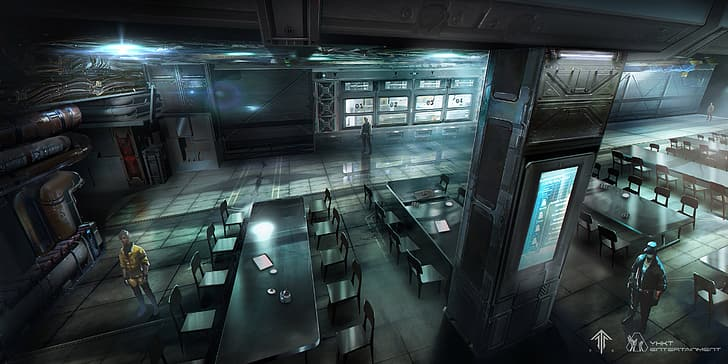
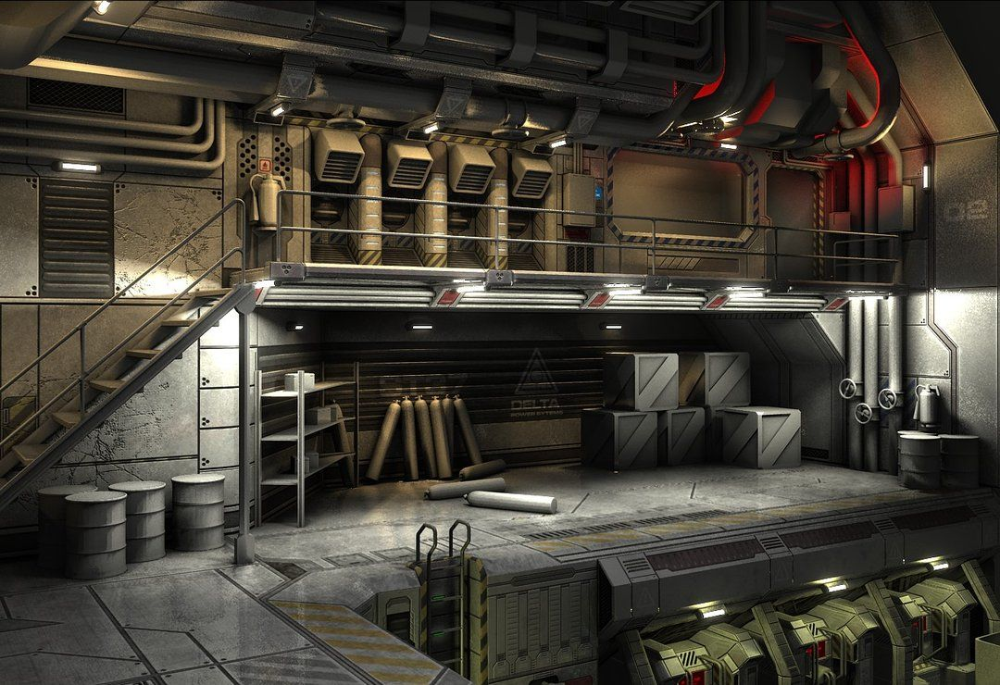
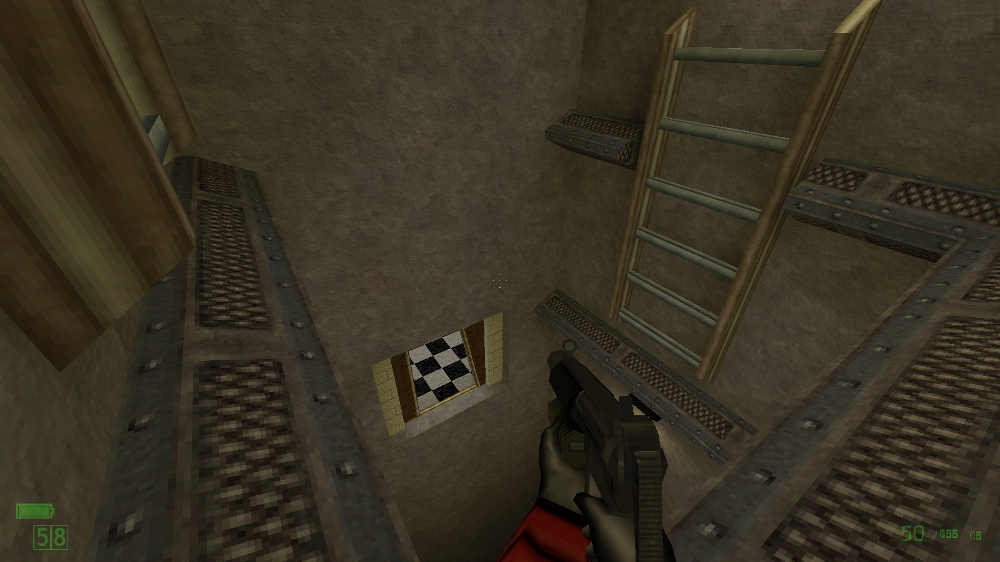
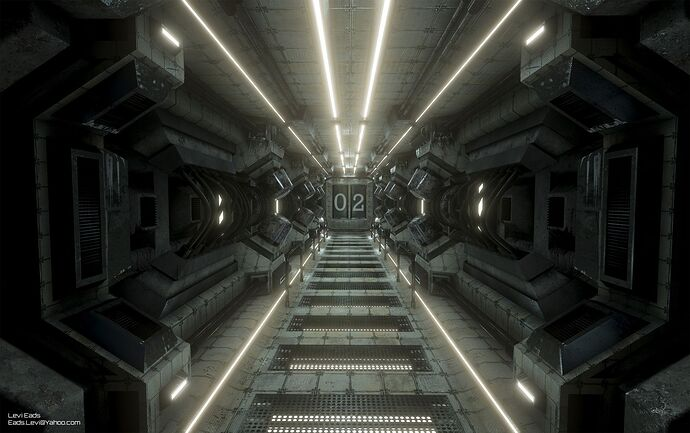
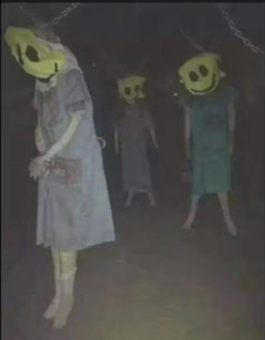
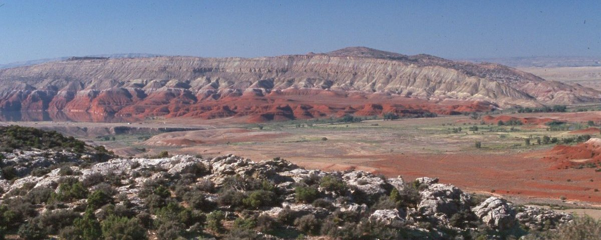
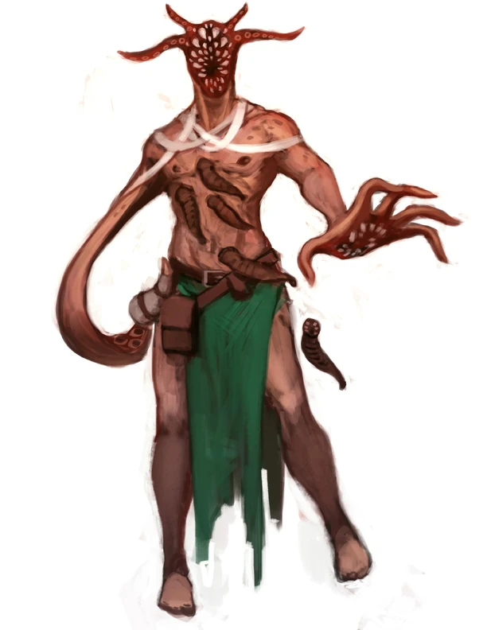
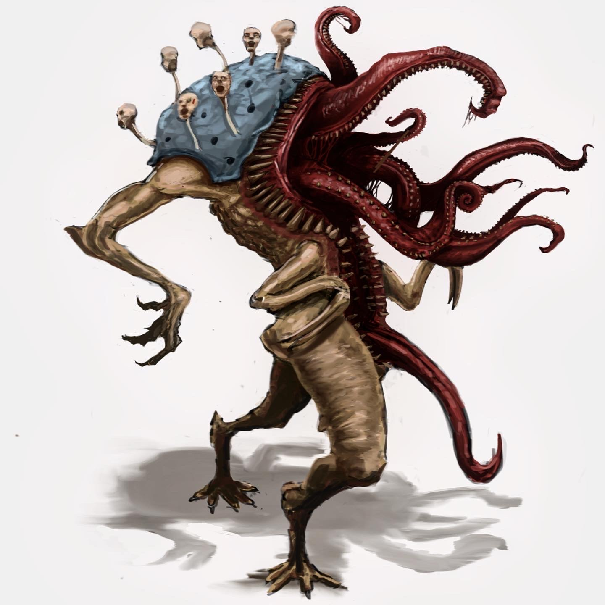

# 2.8 Propuesta de nivel
### Raymundo Mosqueda 

## Theme

- Environment:

    A hidden, underground military base that has been overrun by a cult during the 1980's.
  
  
  
  
  
- Location:

    
    
    The base is located in the middle of the great basin dessert in Nevada.

- Theme:

    dark, horror, big monsters, over the top 80's action.

- Enemies:
  - Cultist Leader:
  - Melee Mutant: 
  - Boss Monster:   
---
## Purpose

- The purpose of the level is to provide an entertaining 10-15 minute experience for the player. as they explore the 
    uppermost level of the base and make creative use of enemy placement to create a challenging and fun 
    experience with little complexity.
---
## Features

- Engaging light gun style gameplay.
- Enemy variety.
  - Smiley cultists with guns that engage you from a distance.
  - Mutated cultists that engage you up close.
  - Large boss monsters with weak points that must be shot in order to do damage.
- Creative use of enemy placement and interactable objects within the level, such as explosive barrels
and hanging objects that can be shot down to crush enemies below.
---
## Story

- The player is a paranormal operative that has been sent to investigate a military base that has been overrun by a cult.
    The cult has taken over the base in order to free the monsters contained within the base which they revere as gods.
    The player must find a way to enter the base, eliminate the cult leaders and re-contain the monsters within.
---
## Blueprint

