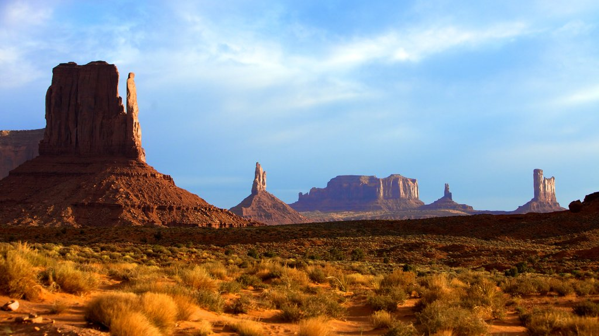

# 2.8 Propuesta de nivel
### Raymundo Mosqueda 

## Theme

- Theme:

- Location: The base is located in the middle of the great basin dessert in Nevada.
    - 
    - 

- Environment: A hidden, underground military base that has been overrun by a cult during the 1980's.
    - Mood/ Lighting reference 
    - Architectural Reference 
    - Gameplay Reference 
    - Set piece Reference 
  
- During this level the player enters the base after reviewing the case while on the car ride there
  as they enter they are ambushed by cultists at the entrance they decide to blast their way in. Over the top 80's action ensues.
---
## Purpose

-  The purpose of this level is to familiarize the player with the mechanics of the game and get them 
   and get them invested in the story. as they explore the uppermost level of the base and make creative 
   use of enemy placement to create a challenging and fun experience with little complexity.

---
## Features

- Engaging light gun style gameplay.
- Enemy variety.
  - Smiley cultists with guns that engage you from a distance.
  - Mutated cultists that engage you up close.
  - Large boss monsters with weak points that must be shot in order to do damage.
- Creative use of enemy placement and interactable objects within the level, such as explosive barrels
and hanging objects that can be shot down to crush enemies below.

---
## Story

- The player is a paranormal operative that has been sent to investigate a military base that has been overrun by a cult.
    The cult has taken over the base in order to free the monsters contained within the base which they revere as gods.
    The player must find a way to enter the base, eliminate the cult leaders and re-contain the monsters within.

---
## Obstaculos

- Enemies:
    - The cult: 
    - Cultist Leader: 
    - Melee mutant: 
    - Boss monster: 
  
- Goals:
    - Reach the elevator at the end of the level before you are killed by the cult.
  
- Set pieces:
  - Al llegar al elevador al final del nivel. los cultistas se suben al elevador por fuera y el jugador debe dispararle a oleadas de cultistas desde la escotilla del elevador antes de que corten los cables.
  - Durante las transiciones de vista hay cultistas escondidos que al dispararles sueltan curaciones para el jugador
  - Regados por el nivel hay barriles explosivos y objetos colgantes que sirven para matar grandes cantidades de cultistas a la vez si se les dispara en el momento correcto.

---
## Blueprint

