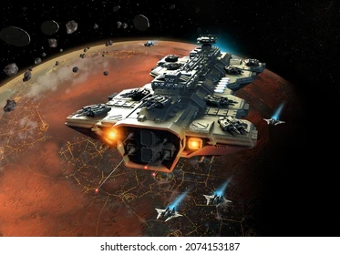

# 4.1 Poject dio propuesta de nivel.
## pista #5: SpaceRace

### Idea
La idea es tener la absurda carrera espacial y que sea la mas intensa y dificil del juego.

### Tema
Environment: Espacio exterior

Location: Una carretera espaial dónde corre el lider de la pandilla despues de convertirse

en el rey del espacio 

Theme: Carrera espacial, surreal, sci-fi

### Proposito

Este es el ultimo nivel. Representa el climax del
juego dónde el protagonista elimina al ultimo lider
de la pandilla. Es una carrera intensa y vertiginosa
sobre de una carretera futurista que está en el espacio.

El proposito de este nivel es hacer que el jugador exprese su dominio
sobre las mecanicas del juego así como presentar el climax de la historia
dónde el protagonista elimina al ultimo lider de la pandilla.

### Features

- Impactantes vistas espaciales
- Vueltas vertiginosas y zonas de alta velocidad
- Esquiva las peligrosas lluvias de meteoritos

### Referencias

1. Arquitectonicas: las imagenes surrealistas que encontré en google :)
   2.  
   2.  
   2.  
 
2. De entorno
3. De iluminacion
4. De props
5. De inspiracion

### Story
### Objetivos, Set pieces y obstaculos
### Focal Points
